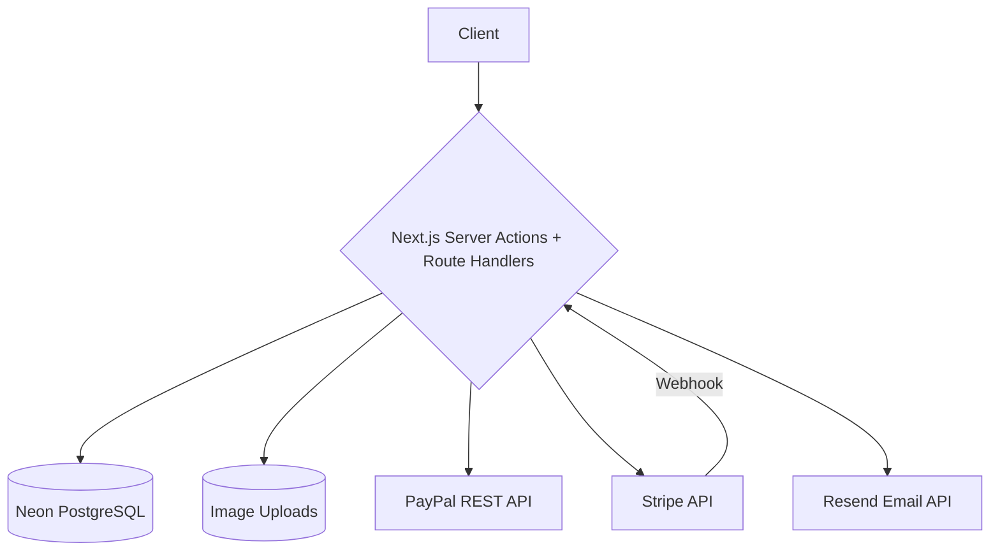
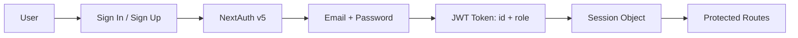

# Eraeva Delivery System

🍽️ **Kenyan Food Delivery & Restaurant Management Platform**

---

## 📌 Problem (Core Idea)

Restaurants and food delivery services lack an integrated, customizable ordering platform:

- Menu management is scattered across PDFs, social media, or generic delivery apps
- No control over branding, pricing, or customer relationships
- Traditional meal structures (protein + starch + vegetable) aren't well-supported by generic food apps
- Payment reconciliation is manual and error-prone
- Order tracking is fragmented between phone calls, text messages, and paper receipts

➡️ **Eraeva Delivery provides a self-hosted, full‑stack restaurant ordering system with menu management, cart, checkout, payments, and admin analytics — purpose‑built for Kenyan/African cuisine.**

---

## 🧑‍💻 Users

| Persona | Needs |
|---|---|
| **Customer** (authenticated) | Browse menu, customize meals with accompaniments, cart, checkout, pay, track orders, leave reviews |
| **Guest** (unauthenticated) | Browse menu, add to cart (session‑based). Must sign in to checkout |
| **Administrator** | Dashboard with sales analytics, CRUD menus/orders/users, mark orders paid/delivered |

---

## ✨ Core Features

### A) Menu System

- Browse meals by meal period (Breakfast, Lunch, Dinner, Dessert, Beverage)
- Filter by category (Beef, Chicken, Vegetarian, etc.), price, rating
- Full‑text search by name/slug
- **Meal customization**: each menu item has configurable accompaniments:
  - **Starch**: Ugali, Chapati, Rice (default free)
  - **Vegetable**: Sukuma Wiki, Cabbage, Kunde Spinach, Managu (some at extra cost)
- Featured products carousel on homepage

### B) Shopping Cart

- Guest carts via `sessionCartId` cookie (no login required to browse)
- Cart merge to user account on sign‑in/sign‑up
- Pricing: 15% tax on items; free shipping over $100, otherwise $10

### C) Checkout & Payments

- Multi‑step flow: Shipping address → Payment method → Place order
- Three payment gateways:
  - **PayPal** (REST API v2, sandbox/live)
  - **Stripe** (Elements + webhook)
  - **Cash on Delivery**
- Atomic order creation with Prisma transaction

### D) Admin Dashboard

- Sales analytics with charts (Recharts)
- Quick stats: total orders, products, users, revenue
- Full CRUD on menus (with image upload via UploadThing)
- Order management (mark paid/delivered)
- User management (role changes, deletion)

### E) User Features

- Order history & detail tracking
- Profile management (name, email, address, payment method)
- Product reviews (rating 1‑5, upsert — one per user per product)

### F) Email Receipts

- Automated purchase receipt via Resend + React Email on successful payment

### G) Authentication

- Email + password credentials (NextAuth v5 with JWT strategy)
- JWT contains user `id` and `role` for session management
- Route protection via middleware (client) + `requireAdmin()` (server)

---

## 🗄️ Data Model (Prisma Schema)

> 9 models + 1 enum — schema in `prisma/schema.prisma`

```prisma
model User {
  id              String    @id @default(uuid()) @db.Uuid
  name            String?
  email           String    @unique
  emailVerified   DateTime?
  image           String?
  password        String?
  role            String    @default("user")
  address         Json?
  paymentMethod   String?
  accounts        Account[]
  sessions        Session[]
  carts           Cart[]
  orders          Order[]
  reviews         Review[]
  createdAt       DateTime  @default(now())
  updatedAt       DateTime  @updatedAt
}

model Menu {
  id            String   @id @default(uuid()) @db.Uuid
  name          String
  slug          String   @unique
  category      String
  images        String[]
  brand         String
  description   String
  stock         Int
  price         Decimal  @db.Decimal(12, 2)
  rating        Decimal  @db.Decimal(12, 2)
  numReviews    Int      @default(0)
  isFeatured    Boolean  @default(false)
  banner        String?
  accompanyId   String?  @db.Uuid
  vegetableId   String?  @db.Uuid
  accompany     MenuAccompaniment? @relation("MenuAccompany", fields: [accompanyId], references: [id])
  vegetable     MenuAccompaniment? @relation("MenuVegetable", fields: [vegetableId], references: [id])
  mealTypes     MenuMealType[]
  orderItems    OrderItem[]
  reviews       Review[]
  createdAt     DateTime @default(now())
  updatedAt     DateTime @updatedAt
}

model Cart {
  id             String   @id @default(uuid()) @db.Uuid
  userId         String?  @db.Uuid
  sessionCartId  String   @unique
  items          Json     @default("[]")
  itemsPrice     Decimal  @db.Decimal(12, 2)
  shippingPrice  Decimal  @db.Decimal(12, 2)
  taxPrice       Decimal  @db.Decimal(12, 2)
  totalPrice     Decimal  @db.Decimal(12, 2)
  user           User?    @relation(fields: [userId], references: [id])
  createdAt      DateTime @default(now())
  updatedAt      DateTime @updatedAt
}

model Order {
  id              String    @id @default(uuid()) @db.Uuid
  userId          String    @db.Uuid
  shippingAddress Json
  paymentMethod   String
  paymentResult   Json?
  itemsPrice      Decimal   @db.Decimal(12, 2)
  shippingPrice   Decimal   @db.Decimal(12, 2)
  taxPrice        Decimal   @db.Decimal(12, 2)
  totalPrice      Decimal   @db.Decimal(12, 2)
  isPaid          Boolean   @default(false)
  paidAt          DateTime?
  isDelivered     Boolean   @default(false)
  deliveredAt     DateTime?
  user            User      @relation(fields: [userId], references: [id])
  orderitems      OrderItem[]
  createdAt       DateTime  @default(now())
  updatedAt       DateTime  @updatedAt
}

model OrderItem {
  orderId String  @db.Uuid
  menuId  String  @db.Uuid
  qty     Int
  price   Decimal @db.Decimal(12, 2)
  name    String
  slug    String
  image   String
  order   Order   @relation(fields: [orderId], references: [id])
  menu    Menu    @relation(fields: [menuId], references: [id])
  @@id([orderId, menuId])
}

model MealType {
  id        String        @id @default(uuid()) @db.Uuid
  name      MealPeriod
  sortOrder Int           @default(0)
  menuMealTypes MenuMealType[]
}

model MenuMealType {
  menuId     String   @db.Uuid
  mealTypeId String   @db.Uuid
  menu       Menu     @relation(fields: [menuId], references: [id])
  mealType   MealType @relation(fields: [mealTypeId], references: [id])
  @@id([menuId, mealTypeId])
}

model MenuAccompaniment {
  id          String  @id @default(uuid()) @db.Uuid
  name        String
  category    String
  description String?
  price       Decimal @db.Decimal(12, 2)
  image       String?
  isDefault   Boolean @default(false)
  menusAsAccompany Menu[] @relation("MenuAccompany")
  menusAsVegetable  Menu[] @relation("MenuVegetable")
}

model Review {
  id                String   @id @default(uuid()) @db.Uuid
  userId            String   @db.Uuid
  menuId            String   @db.Uuid
  rating            Int
  title             String?
  description       String?
  isVerifiedPurchase Boolean @default(false)
  user              User     @relation(fields: [userId], references: [id])
  menu              Menu     @relation(fields: [menuId], references: [id])
  createdAt         DateTime @default(now())
  updatedAt         DateTime @updatedAt
  @@unique([userId, menuId])
}

enum MealPeriod {
  BREAKFAST
  LUNCH
  DINNER
  DESSERT
  BEVERAGE
}
```

---

## 🧱 Tech Stack

| Category       | Choice                                   |
| -------------- | ---------------------------------------- |
| Framework      | **Next.js 16** (App Router)              |
| Language       | TypeScript 5                             |
| Database       | Neon PostgreSQL + Prisma 6 ORM           |
| UI/Styling     | React 19 · Tailwind CSS 3 · shadcn/ui    |
| Auth           | NextAuth v5 (credentials, JWT)           |
| Payments       | PayPal REST API v2 · Stripe · CashOnDelivery |
| File Uploads   | UploadThing                              |
| Email          | Resend + React Email                     |
| Charts         | Recharts                                 |
| Forms          | react-hook-form + Zod                    |
| Testing        | Jest + ts-jest                           |
| Password       | bcrypt-ts-edge                           |
| Linting        | ESLint (next/core-web-vitals)            |
| Runtime        | Node.js 24.14.0 · npm 11.9.0             |

---

## 🎨 UI / UX

- Dark/light mode via `next-themes` (toggle in header)
- Clean, minimal restaurant menu layout
- shadcn/ui component library with Radix primitives
- lucide-react icons throughout

### Layout

- Public: **Header + Footer** with main content area (shared layout)
- Admin: **Sidebar navigation** + content area
- Search: Filter bar with sort/price/category/rating controls, grid results

### Routes

| Route              | Access | Purpose                          |
| ------------------ | ------ | -------------------------------- |
| `/`                | Public | Homepage (featured + popular)    |
| `/search`          | Public | Menu browsing & filtering        |
| `/menu/[slug]`     | Public | Menu item detail + accompaniments|
| `/cart`            | Public | Shopping cart                    |
| `/shipping-address`| Auth   | Shipping address form            |
| `/payment-method`  | Auth   | Payment selection                |
| `/place-order`     | Auth   | Order review & place             |
| `/order/[id]`      | Auth   | Order detail + payment buttons   |
| `/sign-in`         | Public| Auth form                        |
| `/sign-up`         | Public| Registration form                |
| `/admin/*`         | Admin  | Dashboard, products, orders, users|
| `/user/*`          | Auth   | Order history, profile           |

---

## 🔌 API Architecture



---

## 🔐 Auth Flow



- **Guest cart merge**: On sign‑in/up, `sessionCartId` cookie is read, guest cart reassigned to user.
- **Admin guard**: `requireAdmin()` server helper redirects to `/unauthorized` if role ≠ `"admin"`.
- **Middleware**: Protects `/shipping-address`, `/payment-method`, `/place-order`, `/profile`, `/user/*`, `/order/*`, `/admin/*`.

---

## 💳 Payment Flow

```mermaid
flowchart TD
  PlaceOrder[Place Order] --> Tx[Prisma Transaction: Create Order + Clear Cart]
  Tx --> Redirect[/order/[id]]
  Redirect --> Payment{Payment Method}
  Payment -->|PayPal| PayPalBtn[PayPal Button renders]
  PayPalBtn -->|Approve| Capture[paypal.ts capturePayment]
  Capture -->|Success| MarkPaid[Order: isPaid=true, paidAt=now]
  Payment -->|Stripe| StripeForm[Stripe Elements]
  StripeForm -->|Charge| Webhook[/api/webhooks/stripe]
  Webhook -->|charge.succeeded| MarkPaid
  Payment -->|COD| AdminMarks[Admin marks as paid]
  MarkPaid --> Stock[Decrement stock]
  Stock --> Email[sendPurchaseReceipt via Resend]
  Admin --> Deliver[deliverOrder: isDelivered=true]
```

---

## 🗂️ Project Structure

```
src/
├── app/                   # Next.js App Router
│   ├── (auth)/            # Sign-in, sign-up
│   ├── (root)/            # Main site: home, menu, cart, checkout
│   ├── admin/             # Dashboard, CRUD, order/user management
│   ├── user/              # Order history, profile
│   └── api/               # NextAuth, UploadThing, Stripe webhook
├── components/
│   ├── shared/            # Header, Footer, MenuList, Carousel
│   └── ui/                # shadcn/ui (button, card, dialog, etc.)
├── db/
│   ├── prisma.ts          # Configured PrismaClient (Neon + Decimal transforms)
│   ├── sample-data.ts     # Seed data: Kenyan meals & accompaniments
│   └── seed.ts            # Database seeder
├── lib/
│   ├── actions/           # Server Actions: cart, menu, order, review, user
│   ├── constants/         # App config, limits, payment methods
│   ├── validators.ts      # Zod schemas
│   ├── paypal.ts          # PayPal REST API wrapper
│   ├── utils.ts           # formatCurrency, cn(), round2, etc.
│   └── auth-guard.ts      # requireAdmin() server helper
├── email/                 # Resend + React Email templates
├── types/                 # Zod‑inferred TypeScript types
└── assets/styles/         # Tailwind globals.css
```

---

## 🧠 Key Architecture Decisions

| Decision | Rationale |
|---|---|
| **`Menu` model name** (not `Product`) | Domain‑specific naming for restaurant context |
| **Explicit `MenuMealType` join table** | Allows adding extra fields later (e.g., meal‑specific price) |
| **Two FK relations to `MenuAccompaniment`** | Each menu item can have a default starch + default vegetable |
| **Decimal → string conversion** | `PrismaClient.$extends` transforms all Decimal fields to strings to avoid JS float precision issues |
| **Cart merge on sign‑in** | Reads `sessionCartId` cookie in JWT callback, reassigns guest cart to user |
| **No‑op auth stubs** | App boots without crashing when `NEXTAUTH_SECRET` is unset |
| **`PAYAPAL_*` env var typo** | Intentional quirk — not to be "fixed" |
| **Atomic order creation** | `prisma.$transaction` for creating order + clearing cart |

---

## 🧭 Roadmap

### ✅ Current (MVP)

- Menu CRUD & browsing with meal periods
- Shopping cart (guest + authenticated)
- Multi‑step checkout
- PayPal, Stripe, COD payments
- Basic email receipts
- Admin dashboard with charts
- Order & user management
- Product reviews

### 🚧 In Progress / Planned

- Order status tracking / live updates
- Mobile‑optimized responsive refinements
- Additional meal customization options
- Enhanced analytics & reporting
- Coupon / discount system
- Multilingual support (English + Swahili)

### 🔮 Future

- Real‑time order tracking (WebSocket)
- Delivery route optimization
- SMS notifications
- Kitchen display integration
- Multi‑restaurant / multi‑location support
- Native mobile app (React Native)

---

🍽️ **Eraeva Delivery — Savor the taste, we handle the rest.**
